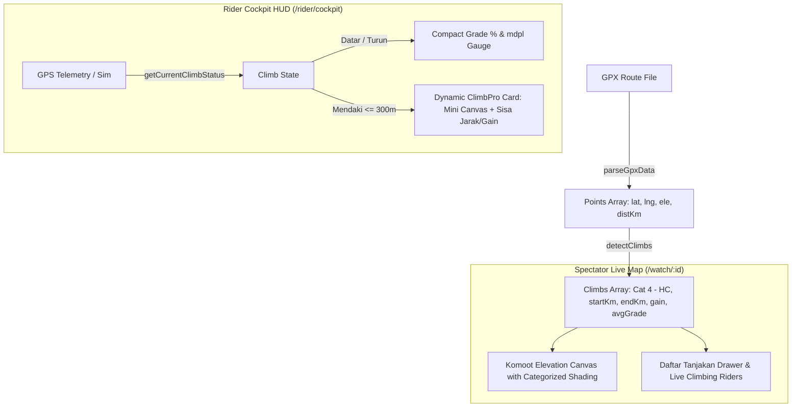

# ClimbPro & Grade % Elevation Analytics Implementation Plan

> **For agentic workers:** REQUIRED SUB-SKILL: Use superpowers:executing-plans to implement this plan task-by-task. Steps use checkbox (`- [ ]`) syntax for tracking.

**Goal:** Menghadirkan analitik tanjakan pintar (ClimbPro) dan kemiringan jalan real-time (Grade %) untuk CycloPon di sisi pesepeda (Rider Cockpit HUD) dan penonton (Spectator Live Map) dengan performa tinggi, zero external runtime dependency, dan 100% offline-ready.

**Architecture:** Algoritma deteksi tanjakan murni client-side di `gpx-utils.js` yang memindai array elevasi GPX dengan smoothing filter, mengidentifikasi tanjakan (panjang >= 500m, gain >= 30m, avg gradient >= 3%), dan mengkategorisasikan tanjakan berdasarkan formula standar UCI/Strava (Cat 4 hingga HC). Cockpit HUD menyajikan kartu dinamis (Grade % + mdpl saat datar, berubah jadi kartu profil tanjakan mini saat mendaki), sedangkan Live Map menampilkan arsiran pita warna kategori di elevasi Komoot dan laci daftar tanjakan rute.

**Architecture Diagram:**

**Tech Stack:** Vanilla JavaScript (ES6+), HTML5 Canvas 2D, Node.js built-in test runner (`node --test`).

**Spec:** [`docs/superpowers/specs/2026-10-05-climbpro-elevation-analytics-design.md`](file:///c:/Users/Mallik/Documents/cyclopon/docs/superpowers/specs/2026-10-05-climbpro-elevation-analytics-design.md)

## Global Constraints

- Tetap ultra-ringan: Tidak menambahkan library NPM atau framework eksternal baru.
- Backward compatibility: Seluruh rute GPX yang sudah ada harus otomatis memiliki analitik tanjakan tanpa migrasi database.
- Konsistensi Tema: Menggunakan warna palet desain CycloPon (Deep Sage, Amber Sand, dan warna kategori tanjakan standar).
- Seluruh 49+ unit test yang sudah ada harus tetap lulus 100%.

---

### Task 1: Climb Detection Algorithm & Unit Tests

**Files:**
- Create: `c:/Users/Mallik/Documents/cyclopon/tests/climb-detection.test.js`
- Modify: `c:/Users/Mallik/Documents/cyclopon/public/js/lib/gpx-utils.js`

**Interfaces:**
- Consumes: `points: Array<{ lat: number, lng: number, ele: number, distKm: number, gradePct: number }>`
- Produces: 
  - `detectClimbs(points, options)`: Returns `Array<ClimbObject>`
  - `getLiveGrade(distKm, points)`: Returns `{ gradePct: number, ele: number }`
  - `getCurrentClimbStatus(distKm, climbs)`: Returns `{ activeClimb: ClimbObject|null, isUpcoming: boolean, distRemainingKm: number, elevRemainingM: number }`

- [ ] **Step 1: Write failing test for Climb Detection & Grade calculations**
  File: `tests/climb-detection.test.js`
  Test scenarios:
  1. Detects Cat 4, Cat 3, Cat 2, Cat 1, and HC climbs correctly from synthetic elevation profiles.
  2. Returns empty array `[]` on flat routes without error.
  3. `getLiveGrade` computes correct instantaneous gradient and altitude.
  4. `getCurrentClimbStatus` calculates accurate remaining distance and elevation gain to summit.

- [ ] **Step 2: Run test to verify it fails**
  Run: `node --test tests/climb-detection.test.js`
  Expected: FAIL (`detectClimbs is not a function`).

- [ ] **Step 3: Implement algorithm in `gpx-utils.js`**
  Implement:
  - Moving average smoothing (5 points window) for GPS elevation jitter.
  - Continuous ascent segment detection (length >= 0.5 km, gain >= 30m, avg gradient >= 3.0%).
  - Categorization: HC (>= 80,000), Cat 1 (>= 64,000), Cat 2 (>= 32,000), Cat 3 (>= 16,000), Cat 4 (< 16,000).
  - Helpers `getLiveGrade` and `getCurrentClimbStatus`.
  - Export functions for both browser environment (`window`) and Node.js (`module.exports`).

- [ ] **Step 4: Run test to verify it passes**
  Run: `node --test tests/climb-detection.test.js`
  Expected: PASS (all tests pass).

- [ ] **Step 5: Commit changes**
  Run: `git commit -am "feat(climbpro): implement climb detection algorithm and unit tests"`

---

### Task 2: Rider Cockpit HUD Grade % & Dynamic ClimbPro Card

**Files:**
- Modify: `c:/Users/Mallik/Documents/cyclopon/public/css/cockpit.css`
- Modify: `c:/Users/Mallik/Documents/cyclopon/public/js/pages/rider-cockpit.js`

**Interfaces:**
- Consumes: `gpxData.climbs`, `gpxData.points`, `getCurrentClimbStatus`, `getLiveGrade`, `rider.distanceKm`
- Produces:
  - Compact Grade % and Altitude mdpl widget in the Cockpit metric grid.
  - `#cockpitClimbCard` dynamic card with mini slope canvas, category pill, distance remaining to summit, and elevation remaining.

- [ ] **Step 1: Add CSS styles in `public/css/cockpit.css`**
  Add styles for:
  - Dynamic grade badge with color levels: Green (<3%), Yellow (4-6%), Orange (7-9%), Red (10-14%), Purple (>=15%).
  - `.cockpit-climb-card`: collapsible container with smooth transitions.
  - Mini profile canvas `#cockpitClimbCanvas` and category badges (`.climb-cat-pill`).

- [ ] **Step 2: Add HTML structure in `public/js/pages/rider-cockpit.js`**
  - Add stat box for Grade % & Altitude in the primary metric grid.
  - Add the dynamic `#cockpitClimbCard` container above the mini breadcrumb map.

- [ ] **Step 3: Implement telemetry update logic and Canvas mini profile**
  - In `updateCockpitTelemetry()`, call `getLiveGrade(distKm, points)` and update Grade % + mdpl.
  - Call `getCurrentClimbStatus(distKm, climbs)`:
    - If active/upcoming climb: expand card, render mini slope profile on canvas with rider marker dot, update remaining km and remaining ascent (+m).
    - If flat/downhill: smoothly collapse the climb card.

- [ ] **Step 4: Verify functionality in browser**
  Test using the built-in Simulator toggle (`🎮 Sim`) on `/rider/cockpit` to watch the ClimbPro card activate as the rider traverses climbs.

- [ ] **Step 5: Commit changes**
  Run: `git commit -am "feat(cockpit): integrate live grade % and dynamic ClimbPro card in rider HUD"`

---

### Task 3: Spectator Live Map Climb Highlights & Climb Drawer

**Files:**
- Modify: `c:/Users/Mallik/Documents/cyclopon/public/css/map.css`
- Modify: `c:/Users/Mallik/Documents/cyclopon/public/js/pages/live-map.js`

**Interfaces:**
- Consumes: `gpxData.climbs`, `checkpoints`, `progressById`
- Produces:
  - Shaded category highlight bands on the Komoot elevation chart (`#elevationCanvas`).
  - Summit flag markers (`⛰️ C1`, `⛰️ C2`) along the profile.
  - "⛰️ Tanjakan" drawer / toggle list displaying all climbs and live riders ascending them.

- [ ] **Step 1: Update Komoot elevation canvas drawing in `live-map.js`**
  - In `redrawElevationChart()`, overlay colored slices for detected climb segments (`climb.color`).
  - Render summit flags (`⛰️ C1`, `⛰️ C2`) with category labels at each climb's `endKm`.

- [ ] **Step 2: Add Climb List Drawer & Toggle Button**
  - Add `#btnToggleClimbs` button in header actions or Komoot elevation toolbar.
  - Add `#climbsDrawer` listing each climb: Name, Category Pill, KM span, Length, Gain, Avg/Max Grade, and live count of riders currently inside that segment.

- [ ] **Step 3: Add CSS styles in `public/css/map.css`**
  Add styles for the climb list items, category tags, and responsive layout.

- [ ] **Step 4: Run full test suite**
  Run: `node --test`
  Verify all existing and new tests pass without regressions.

- [ ] **Step 5: Commit changes**
  Run: `git commit -am "feat(spectator): add climb highlights on elevation canvas and climb list drawer"`

---

### Task 4: Final Verification & Documentation

- [ ] **Step 1: Run all unit tests**
  Run: `node --test`
  Confirm 100% pass across all test suites.

- [ ] **Step 2: Update PROGRESS_REPORT.md**
  Document Phase 12: ClimbPro & Elevation Analytics in `PROGRESS_REPORT.md`.

- [ ] **Step 3: Commit final deliverables**
  Run: `git commit -am "docs: update progress report with Phase 12 ClimbPro and Grade % features"`
