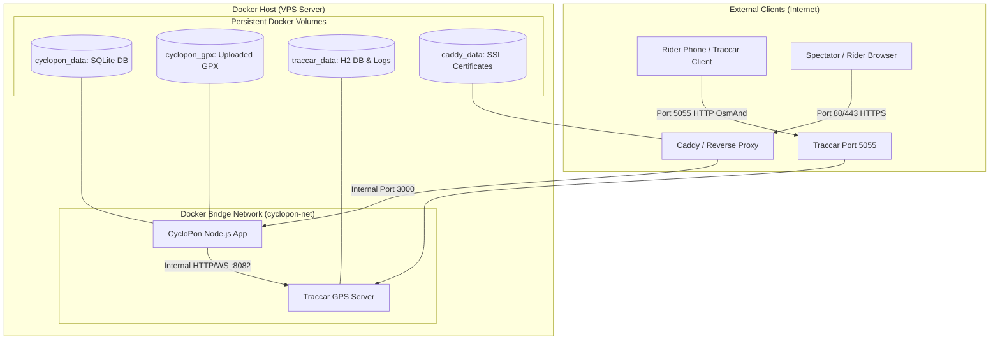

# Docker Containerization & Deployment Stack Implementation Plan

> **For agentic workers:** REQUIRED SUB-SKILL: Use superpowers:subagent-driven-development to implement this plan task-by-task. Steps use checkbox (`- [ ]`) syntax for tracking.

**Goal:** Menyediakan bundel containerization siap pakai (Dockerfile & Docker Compose) untuk aplikasi CycloPon dan Traccar GPS Server dengan reverse proxy SSL otomatis dan panduan deployment VPS lengkap.

**Architecture:** Menjalankan CycloPon (Node.js 22 Express PWA) dan Traccar Server (Java GPS listener) dalam container terisolasi yang terhubung melalui Docker bridge network. Posisi GPS OsmAnd dari ponsel pesepeda diterima oleh Traccar pada port 5055, sementara CycloPon bertindak sebagai aplikasi web utama pada port 3000 dengan WebSocket bridge internal. Opsi produksi menyertakan Caddy untuk penerbitan sertifikat SSL/HTTPS otomatis tanpa konfigurasi rumit.

**Architecture Diagram:**

**Tech Stack:**
- Docker Engine 24+ & Docker Compose v2
- Node.js 22 Alpine (Multi-stage build)
- Traccar GPS Server (`traccar/traccar:alpine`)
- Caddy Server 2 (`caddy:alpine`) untuk Automatic HTTPS
- SQLite3 WAL mode persistent storage

**Spec:** Rekomendasi Langkah Berikutnya pada `PROGRESS_REPORT.md` (Section 13, Poin 1: Containerization).

## Global Constraints

- Tetap mempertahankan prinsip **zero-bloat**: ukuran image Docker harus seramping mungkin (< 150 MB untuk CycloPon).
- File database SQLite (`data/cyclopon.db`) dan GPX uploads (`public/gpx/`) **wajib** dipetakan ke Docker named volume atau host mount agar data tidak hilang saat container di-restart atau di-upgrade.
- Traccar server harus dikonfigurasi ringan (non-aktifkan geocoder eksternal dan protokol yang tidak dipakai pesepeda untuk menghemat memori VPS).
- Kompatibel dengan VPS berbiaya rendah (1 vCPU, 1–2 GB RAM pada Ubuntu/Debian).

---

### Task 1: Dockerfile & .dockerignore untuk Aplikasi CycloPon

**Files:**
- Create: `c:/Users/Mallik/Documents/cyclopon/.dockerignore`
- Create: `c:/Users/Mallik/Documents/cyclopon/Dockerfile`

**Interfaces:**
- Consumes: Node.js 22 source code, `package.json`, `package-lock.json`
- Produces: Production Docker image `cyclopon:latest` dengan healthcheck di `/api/health`

- [ ] **Step 1: Buat file `.dockerignore`**
  Kecualikan `node_modules`, `data/*.db*`, `.git`, `.env`, `tests/`, logs, and temporary files agar build context cepat dan aman.
- [ ] **Step 2: Buat multi-stage `Dockerfile`**
  - Stage 1 (Builder): Menggunakan `node:22-alpine`, install build tools untuk `better-sqlite3`, dan jalankan `npm ci --omit=dev`.
  - Stage 2 (Runner): Menggunakan `node:22-alpine` minimal, salin `node_modules` dari builder, salin source code, setup non-root user atau folder permission, ekspos port 3000.
  - Tambahkan instruksi `HEALTHCHECK` memanggil `wget -qO- http://localhost:3000/api/health`.
- [ ] **Step 3: Verifikasi sintaks Dockerfile**
  Periksa kelengkapan file dan kesesuaian perintah run.
- [ ] **Step 4: Commit changes**
  Run: `git commit -m "feat(docker): add multi-stage Dockerfile and .dockerignore for CycloPon"`

---

### Task 2: Konfigurasi Traccar Server Mandiri (`traccar.xml`)

**Files:**
- Create: `c:/Users/Mallik/Documents/cyclopon/docker/traccar/traccar.xml`

**Interfaces:**
- Consumes: Traccar Alpine base configuration
- Produces: Pre-tuned XML config yang fokus pada OsmAnd port 5055, internal H2 DB, non-aktifkan geocoder eksternal.

- [ ] **Step 1: Siapkan folder `docker/traccar`**
- [ ] **Step 2: Buat `traccar.xml` teroptimasi untuk gowes**
  - Aktifkan port 5055 (OsmAnd protocol).
  - Web port 8082.
  - Disable reverse geocoding untuk hemat resource dan kuota API eksternal.
  - Set device status timeout ke 120 detik.
- [ ] **Step 3: Commit changes**
  Run: `git commit -m "feat(docker): add pre-tuned lightweight traccar.xml configuration"`

---

### Task 3: Docker Compose Stack Utama (`docker-compose.yml`)

**Files:**
- Create: `c:/Users/Mallik/Documents/cyclopon/docker-compose.yml`

**Interfaces:**
- Consumes: CycloPon image build & Traccar image
- Produces: 1-command startup `docker compose up -d` yang mengorkestrasikan CycloPon + Traccar bersama volume persisten.

- [ ] **Step 1: Susun service `cyclopon`**
  - Build context `./`
  - Ports: `3000:3000`
  - Environment variables: `TRACCAR_HOST=http://traccar:8082`, `PORT=3000`, etc.
  - Volumes: `cyclopon_data:/app/data`, `cyclopon_gpx:/app/public/gpx`
  - Depends on `traccar`
  - Restart: `unless-stopped`
- [ ] **Step 2: Susun service `traccar`**
  - Image: `traccar/traccar:alpine`
  - Ports: `5055:5055`, `8082:8082`
  - Volumes: `./docker/traccar/traccar.xml:/opt/traccar/conf/traccar.xml:ro`, `traccar_data:/opt/traccar/data`, `traccar_logs:/opt/traccar/logs`
  - Restart: `unless-stopped`
- [ ] **Step 3: Definisikan shared network & named volumes**
  - Network: `cyclopon-net`
  - Volumes: `cyclopon_data`, `cyclopon_gpx`, `traccar_data`, `traccar_logs`
- [ ] **Step 4: Commit changes**
  Run: `git commit -m "feat(docker): add docker-compose.yml for local and self-hosted deployments"`

---

### Task 4: Konfigurasi Production Reverse Proxy (Caddy SSL)

**Files:**
- Create: `c:/Users/Mallik/Documents/cyclopon/docker/caddy/Caddyfile`
- Create: `c:/Users/Mallik/Documents/cyclopon/docker-compose.prod.yml`

**Interfaces:**
- Consumes: Domain name via environment variable `DOMAIN`
- Produces: Auto-managed Let's Encrypt HTTPS untuk port 80 & 443 dengan proxy WebSocket ke CycloPon.

- [ ] **Step 1: Buat `docker/caddy/Caddyfile`**
  Konfigurasi reverse proxy ke `cyclopon:3000` dengan dukungan WebSocket streaming (`/traccar-ws`).
- [ ] **Step 2: Buat `docker-compose.prod.yml`**
  Menambahkan container Caddy pada port 80 & 443 dan mengekspos port 5055 Traccar untuk protokol OsmAnd pesepeda.
- [ ] **Step 3: Commit changes**
  Run: `git commit -m "feat(docker): add Caddy automatic HTTPS stack and docker-compose.prod.yml"`

---

### Task 5: Script Operasional (Backup & Restore) & Panduan Deployment VPS

**Files:**
- Create: `c:/Users/Mallik/Documents/cyclopon/scripts/backup.sh`
- Create: `c:/Users/Mallik/Documents/cyclopon/scripts/restore.sh`
- Create: `c:/Users/Mallik/Documents/cyclopon/DEPLOYMENT.md`

**Interfaces:**
- Consumes: SQLite database and uploaded GPX directory
- Produces: Timestamped `.tar.gz` backup archive, restore utility, and step-by-step VPS hosting documentation.

- [ ] **Step 1: Buat script `scripts/backup.sh`**
  Ekstrak database SQLite (`cyclopon.db`) menggunakan `sqlite3 .backup` atau hot copy dengan aman, kompres bersama folder `public/gpx/`.
- [ ] **Step 2: Buat script `scripts/restore.sh`**
  Ekstrak backup archive kembali ke volume data dengan konfirmasi keselamatan.
- [ ] **Step 3: Tulis panduan `DEPLOYMENT.md`**
  - Rekomendasi spesifikasi VPS (1 vCPU, 1 GB RAM, DigitalOcean / Hetzner / Contabo / IDCloudHost).
  - Port firewall yang wajib dibuka (`3000`, `5055`, `80`, `443`).
  - Langkah instalasi Docker di Ubuntu/Debian.
  - Cara clone repository, copy `.env.example` ke `.env`, dan jalankan `docker compose up -d`.
  - Konfigurasi aplikasi OsmAnd / Traccar Client pada smartphone peserta gowes (`http://IP-VPS:5055`).
  - Cara aktifkan HTTPS domain gratis via Caddy.
- [ ] **Step 4: Commit changes**
  Run: `git commit -m "docs(deployment): add backup/restore scripts and comprehensive VPS deployment guide"`

---

### Task 6: Sinkronisasi Dokumentasi Proyek

**Files:**
- Modify: `c:/Users/Mallik/Documents/cyclopon/README.md`
- Modify: `c:/Users/Mallik/Documents/cyclopon/PROGRESS_REPORT.md`

- [ ] **Step 1: Tambahkan bagian Docker Quickstart di `README.md`**
- [ ] **Step 2: Perbarui `PROGRESS_REPORT.md` menandai Phase 13 (Containerization) sebagai Selesai**
- [ ] **Step 3: Jalankan uji verifikasi unit `npm test` untuk memastikan integritas kode tetap 100% lulus**
- [ ] **Step 4: Commit final changes**
  Run: `git commit -m "docs: update README and PROGRESS_REPORT with docker containerization details"`
