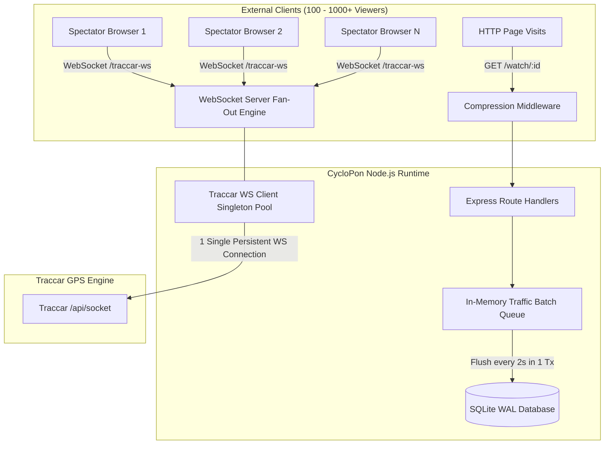

# Performance Optimization & Stress Benchmark Implementation Plan

> **For agentic workers:** REQUIRED SUB-SKILL: Use superpowers:subagent-driven-development to implement this plan task-by-task. Steps use checkbox (`- [ ]`) syntax for tracking.

**Goal:** Mengoptimalkan skalabilitas CycloPon saat event berlangsung dengan ribuan penonton simultan melalui WebSocket fan-out singleton, in-memory I/O batching, kompresi aset GPX, serta script load testing terotomasi.

**Architecture:** Mengganti arsitektur 1-to-1 WebSocket proxy dengan pola **Singleton Upstream Connection Pool & Fan-Out Broadcast** (1 koneksi terisolasi ke Traccar untuk N penonton), mengisolasi synchronous SQLite disk writes pada traffic middleware ke dalam **Asynchronous In-Memory Batch Queue**, menambahkan HTTP gzip compression untuk file GPX dan JSON, serta menyediakan suite benchmark beban (`npm run benchmark`).

**Architecture Diagram:**

**Tech Stack:**
- Node.js 22 & Express 5
- WebSocket (`ws`) library
- `better-sqlite3` WAL transactions
- `compression` middleware (Gzip / Deflate)
- Node test runner (`node --test`)

**Spec:** Rekomendasi audit arsitektur performa & ketahanan beban sistem saat live race tracking.

## Global Constraints

- Wajib menerapkan prinsip **Zero Breaking Changes**: seluruh 73 unit test yang sudah ada harus tetap 100% lulus.
- Setiap langkah harus diuji secara terisolasi sebelum beralih ke langkah berikutnya.
- Tidak boleh memblokir main event loop Node.js pada penanganan traffic tinggi.
- Tetap mempertahankan reliabilitas rekoneksi otomatis jika server Traccar sempat restart.

---

### Task 1: WebSocket Proxy Singleton Upstream & Fan-Out Broadcast Engine

**Files:**
- Modify: `c:/Users/Mallik/Documents/cyclopon/lib/traccar-ws-proxy.js`
- Modify: `c:/Users/Mallik/Documents/cyclopon/tests/traffic-metrics.test.js`

**Interfaces:**
- Consumes: Traccar `/api/socket` feed
- Produces: `setupTraccarWsProxy(httpServer)`, `getActiveViewersCount()`, `getPeakViewersCount()`, `broadcastToClients(data)`

- [x] **Step 1: Tulis unit test untuk verifikasi Singleton Upstream & Broadcast Fan-out**
  Pastikan saat 10 client browser terhubung bersamaan, hanya ada 1 koneksi outbound yang dibuka ke server Traccar, dan pesan dari Traccar tersiar ke seluruh 10 client.
- [x] **Step 2: Jalankan test dan amati kegagalan**
  Jalankan: `node --test tests/traffic-metrics.test.js`
- [x] **Step 3: Implementasikan Singleton Upstream & Fan-out di `lib/traccar-ws-proxy.js`**
  - Buat satu instance `upstreamWs` bersama fungsi `connectUpstream()` yang dilengkapi exponential backoff reconnection.
  - Pada event `upstreamWs.on('message')`, lakukan looping broadcast: `for (const client of wss.clients) { if (client.readyState === WebSocket.OPEN) client.send(data); }`.
  - Simpan dan distribusikan state cache terakhir jika ada client baru terhubung.
- [x] **Step 4: Jalankan test dan pastikan semua lulus**
  Jalankan: `node --test tests/traffic-metrics.test.js`
- [x] **Step 5: Jalankan keseluruhan test suite untuk memastikan zero regression**
  Jalankan: `npm test`
- [x] **Step 6: Commit changes**
  Jalankan: `git commit -am "feat(perf): implement singleton upstream connection and fan-out broadcast in traccar ws proxy"`

---

### Task 2: In-Memory Batch Queue untuk Traffic Analytics Tracker

**Files:**
- Create: `c:/Users/Mallik/Documents/cyclopon/lib/traffic-queue.js`
- Modify: `c:/Users/Mallik/Documents/cyclopon/server.js`
- Test: `c:/Users/Mallik/Documents/cyclopon/tests/traffic-metrics.test.js`

**Interfaces:**
- Consumes: HTTP request metadata (`path`, `event_id`, `ip_hash`, `user_agent`)
- Produces: `enqueuePageView(data)`, `flushQueue()`, `stopQueue()`

- [x] **Step 1: Tulis unit test untuk in-memory queue & batch flush**
  Uji bahwa entri yang di-enqueue tertampung di memori dan di-flush secara efisien via transaksi SQLite tanpa pemanggilan disk I/O per-request.
- [x] **Step 2: Jalankan test untuk memverifikasi modul baru**
  Jalankan: `node --test tests/traffic-metrics.test.js`
- [x] **Step 3: Buat implementasi `lib/traffic-queue.js`**
  - Simpan buffer array `queue = []`.
  - Jika queue mencapai batas (misal 50 entri) atau interval waktu (2 detik) tercapai, jalankan transaksi batch `db.transaction(...)`.
  - Sediakan graceful shutdown hook pada `process.on('SIGINT')` / `process.on('SIGTERM')`.
- [x] **Step 4: Integrasikan ke middleware di `server.js`**
  Gantikan pemanggilan langsung `db.recordPageView.run(...)` dengan `enqueuePageView(...)`.
- [x] **Step 5: Verifikasi dengan test runner**
  Jalankan: `npm test`
- [x] **Step 6: Commit changes**
  Jalankan: `git commit -am "feat(perf): add in-memory batch queue for traffic analytics to eliminate sync disk I/O"`

---

### Task 3: HTTP Response Compression (Gzip / Deflate)

**Files:**
- Modify: `c:/Users/Mallik/Documents/cyclopon/package.json`
- Modify: `c:/Users/Mallik/Documents/cyclopon/server.js`
- Create/Test: `c:/Users/Mallik/Documents/cyclopon/tests/compression.test.js`

**Interfaces:**
- Consumes: Express request stream
- Produces: Gzipped response payload jika client mendukung header `Accept-Encoding: gzip`

- [x] **Step 1: Tulis unit test untuk verifikasi gzip header**
  Test endpoint `/api/health` dan file GPX atau data JSON dengan header `Accept-Encoding: gzip`, lalu verifikasi respon menyertakan header `Content-Encoding: gzip`.
- [x] **Step 2: Jalankan test untuk memastikan test mendeteksi ketiadaan kompresi**
  Jalankan: `node --test tests/compression.test.js`
- [x] **Step 3: Pasang dependensi `compression` dan pasang di `server.js`**
  Jalankan `npm install compression` dan tambahkan `app.use(compression({ threshold: 1024 }))` sebelum rute statis dan API.
- [x] **Step 4: Jalankan test dan pastikan kompresi berhasil diverifikasi**
  Jalankan: `node --test tests/compression.test.js`
- [x] **Step 5: Verifikasi seluruh test suite**
  Jalankan: `npm test`
- [x] **Step 6: Commit changes**
  Jalankan: `git commit -am "feat(perf): add HTTP response compression for static GPX and JSON payloads"`

---

### Task 4: Automated Benchmark & Stress Testing Script

**Files:**
- Create: `c:/Users/Mallik/Documents/cyclopon/scripts/benchmark.js`
- Modify: `c:/Users/Mallik/Documents/cyclopon/package.json` (tambahkan script `benchmark`)

**Interfaces:**
- Consumes: Server lokal CycloPon di port uji
- Produces: Ringkasan metrik terminal (Total requests, WebSocket clients connected, latensi rata-rata P50/P99, memory RSS usage, 0 error rate)

- [x] **Step 1: Buat script benchmark `scripts/benchmark.js`**
  - Mensimulasikan 100-500 klien WebSocket simultan yang menerima live fan-out telemetri.
  - Mensimulasikan burst 200 HTTP telemetry batch POST `/api/events/:id/history`.
  - Mengukur durasi eksekusi, respon per detik (RPS), dan latency percentiles.
- [x] **Step 2: Tambahkan perintah `"benchmark": "node scripts/benchmark.js"` di `package.json`**
- [x] **Step 3: Jalankan benchmark dan catat hasil performa**
  Jalankan: `npm run benchmark`
- [x] **Step 4: Commit script benchmark**
  Jalankan: `git commit -am "feat(benchmark): add automated stress & concurrency benchmark test suite"`

---

### Task 5: Dokumentasi & Sinkronisasi Progress Report

**Files:**
- Modify: `c:/Users/Mallik/Documents/cyclopon/PROGRESS_REPORT.md`
- Modify: `c:/Users/Mallik/Documents/cyclopon/README.md`

- [ ] **Step 1: Perbarui `PROGRESS_REPORT.md` dengan Phase 22 (Performance & Scalability Optimization)**
- [ ] **Step 2: Perbarui `README.md` dengan informasi script `npm run benchmark`**
- [ ] **Step 3: Jalankan final verification `npm test`**
- [ ] **Step 4: Commit final changes**
  Jalankan: `git commit -am "docs: record performance optimizations and benchmark results in PROGRESS_REPORT"`
