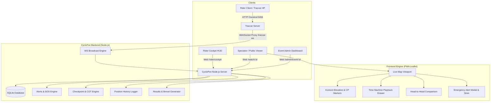

# CycloPon Strategic Enhancement Implementation Plan (Poin 1 - 5)

> **For agentic workers:** REQUIRED SUB-SKILL: Use superpowers:subagent-driven-development to implement this plan task-by-task. Steps use checkbox (`- [ ]`) syntax for tracking. Execution proceeds phase-by-phase with verification and user testing checkpoints after each phase.

**Goal:** Mengembangkan CycloPon menjadi platform live tracking kelas event (Audax / Ultra-cycling / Gran Fondo) yang lengkap melalui 5 pilar utama: Fitur Keselamatan (SOS & Off-route), Manajemen Checkpoint & Cut-Off Time, Spectator Time Machine Replay, Rider Live Cockpit HUD, dan Rekap Hasil / Sertifikat Brevet Resmi.

**Architecture:** Node.js (Express 5 + SQLite via better-sqlite3) dengan WebSockets real-time dan client-side PWA (Leaflet.js + Canvas). Data posisi GPS Traccar diperkaya dengan kalkulasi geofencing deviasi rute (off-route), status baterai, split time checkpoint otomatis, snapshot histori pergerakan untuk time machine, serta dashboard khusus rider dan sertifikat finisher digital.

**Architecture Diagram:**

**Tech Stack:** 
- Backend: Node.js 24+, Express 5, `better-sqlite3`, `ws`
- Frontend: Vanilla JavaScript (ES6+), Leaflet 1.9.4, HTML5 Canvas, PWA Service Worker, Screen Wake Lock API
- Testing: Built-in Node test runner (`node --test`)
- Storage: SQLite (`data/cyclopon.db`)

## Global Constraints

- Preserve WAL mode and foreign key constraints in `db/database.js`.
- Semua tampilan UI harus konsisten dengan Dark Theme CycloPon (`#080A0F`, `#0D1117`, aksen kuning `#FFE600`, cyan `#00E5FF`, merah `#EF4444`, hijau `#10B981`).
- Tetap ringan tanpa framework runtime berat (Vanilla JS, modular ES pages).
- Setiap poin harus dapat diuji secara mandiri (termasuk via mode Simulator).

---

## 📌 PHASE 1: Fitur Keselamatan & Race Control (Safety Engine)

Tujuan: Memastikan keselamatan rider dengan deteksi nyasar (off-route), indikator baterai HP, dan pengiriman sinyal darurat (SOS) seketika ke panitia/penonton.

### Task 1.1: SOS Alert Database Schema & API
**Files:**
- Modify: `c:/Users/Mallik/Documents/cyclopon/db/database.js`
- Create: `c:/Users/Mallik/Documents/cyclopon/routes/alerts.js`
- Modify: `c:/Users/Mallik/Documents/cyclopon/server.js`
- Create: `c:/Users/Mallik/Documents/cyclopon/tests/alerts.test.js`

**Interfaces:**
- Consumes: `event_id`, `rider_id`, `type` ('CRASH'|'MECHANICAL'|'MEDICAL'|'OTHER'), `lat`, `lng`, `message`
- Produces: `POST /api/events/:id/alerts`, `GET /api/events/:id/alerts`, `PUT /api/alerts/:id/resolve`

- [x] **Step 1: Write failing test for Alerts API**
  File: `tests/alerts.test.js`
  Test create alert, fetch active alerts, resolve alert.
- [x] **Step 2: Run test to verify it fails**
  Run: `node --test tests/alerts.test.js` (Expected: FAIL)
- [x] **Step 3: Implement database table and routes**
  Add table `alerts` in `db/database.js` (`id`, `event_id`, `rider_id`, `type`, `lat`, `lng`, `message`, `resolved`, `created_at`).
  Implement `routes/alerts.js` and register in `server.js`.
- [x] **Step 4: Run test to verify it passes**
  Run: `node --test tests/alerts.test.js` (Expected: PASS)
- [x] **Step 5: Commit changes**
  Run: `git commit -m "feat(safety): add alerts and SOS database schema and REST API"`

---

### Task 1.2: Rider SOS Trigger UI
**Files:**
- Modify: `c:/Users/Mallik/Documents/cyclopon/public/js/pages/rider-setup.js`
- Modify: `c:/Users/Mallik/Documents/cyclopon/public/css/rider.css`

**Interfaces:**
- Consumes: Rider auth session in localStorage (`rider_id`, `event_id`, `bib`, `name`)
- Produces: SOS modal with 1-tap emergency dispatch (`navigator.geolocation` or prompt)

- [x] **Step 1: Add SOS button and confirmation modal in Rider Setup page**
  Add floating/prominent Red SOS button: "🚨 BUTUH BANTUAN DARURAT (SOS)".
  Modal asks for category: Medis / Kecelakaan / Masalah Sepeda / Bantuan Umum.
- [x] **Step 2: Connect to `POST /api/events/:id/alerts`**
  Get current GPS position from browser or rider last known position and submit alert.
- [x] **Step 3: Verification**
  Test in browser: open `/rider/setup`, trigger SOS, verify alert recorded in database.

---

### Task 1.3: Geofencing & Off-Route Detection Math
**Files:**
- Modify: `c:/Users/Mallik/Documents/cyclopon/public/js/lib/gpx-utils.js`
- Create: `c:/Users/Mallik/Documents/cyclopon/tests/gpx-offroute.test.js`

**Interfaces:**
- Consumes: `lat`, `lng`, `routeCoords`
- Produces: `{ isOffRoute: boolean, deviationMeters: number, nearestPoint: [lat, lng] }`

- [x] **Step 1: Write failing test for perpendicular deviation calculation**
  File: `tests/gpx-offroute.test.js`
  Check that point 20m from route returns `isOffRoute: false`, point 150m returns `isOffRoute: true` (threshold: 100m).
- [x] **Step 2: Run test to verify it fails**
  Run: `node --test tests/gpx-offroute.test.js`
- [x] **Step 3: Implement `checkOffRoute(lat, lng, routeCoords, thresholdMeters = 100)`**
  Compute distance to nearest segment in `gpx-utils.js`.
- [x] **Step 4: Run test to verify it passes**
  Run: `node --test tests/gpx-offroute.test.js`
- [x] **Step 5: Commit changes**
  Run: `git commit -m "feat(safety): implement off-route deviation math in gpx-utils"`

---

### Task 1.4: Battery Telemetry & Safety Alerts on Live Map
**Files:**
- Modify: `c:/Users/Mallik/Documents/cyclopon/public/js/pages/live-map.js`
- Modify: `c:/Users/Mallik/Documents/cyclopon/public/css/map.css`

**Interfaces:**
- Consumes: `pos.attributes.batteryLevel`, SOS alert list from `/api/events/:id/alerts`, `checkOffRoute`
- Produces:
  1. Battery level icon (% & low battery warning < 20%) in rider popup and leaderboard.
  2. Red pulsing "OFF-ROUTE" badge on riders deviating > 100m.
  3. Floating Emergency Alert Banner with audio chime and "Focus to Location" button.
  4. Admin "Resolve Alert" button in popup.

- [x] **Step 1: Parse battery level from Traccar telemetry and update simulator**
- [x] **Step 2: Add off-route checking in `updateRiderPosition`**
- [x] **Step 3: Add real-time SOS alert polling/socket listener and top alert banner**
- [x] **Step 4: Commit changes**
  Run: `git commit -m "feat(safety): integrate battery telemetry, off-route warnings, and SOS alerts on live map"`

> 🏁 **CHECKPOINT 1:** Uji coba Poin 1 bersama user: Buka `/watch/:id`, jalankan simulator, uji tombol SOS, periksa indikator baterai dan deteksi nyasar.

---

## 📌 PHASE 2: Manajemen Checkpoint & Cut-Off Time (Audax COT Engine)

Tujuan: Menghitung secara otomatis waktu tempuh rider di setiap pos (CP 1, CP 2, Water Station) dan mendeteksi apakah rider memenuhi batas waktu resmi (Cut-Off Time / COT).

### Task 2.1: Checkpoints & Splits Database Schema & REST API
**Files:**
- Modify: `c:/Users/Mallik/Documents/cyclopon/db/database.js`
- Create: `c:/Users/Mallik/Documents/cyclopon/routes/checkpoints.js`
- Modify: `c:/Users/Mallik/Documents/cyclopon/server.js`
- Create: `c:/Users/Mallik/Documents/cyclopon/tests/checkpoints.test.js`

**Interfaces:**
- Consumes: `event_id`, `name`, `km_distance`, `open_time`, `close_time`, `order_index`
- Produces: CRUD `/api/events/:id/checkpoints`, Split time logging `/api/events/:id/splits`

- [x] **Step 1: Write failing test for Checkpoints and Splits API**
  File: `tests/checkpoints.test.js`
- [x] **Step 2: Run test to verify it fails**
  Run: `node --test tests/checkpoints.test.js`
- [x] **Step 3: Implement database tables and routes**
  Tables: `checkpoints`, `rider_splits` (`rider_id`, `checkpoint_id`, `arrival_time`, `status`).
- [x] **Step 4: Run test to verify it passes**
  Run: `node --test tests/checkpoints.test.js`
- [x] **Step 5: Commit changes**
  Run: `git commit -m "feat(cot): add checkpoints and split times API and database schema"`

---

### Task 2.2: Admin Checkpoint Manager in Event Settings
**Files:**
- Modify: `c:/Users/Mallik/Documents/cyclopon/public/js/pages/admin-event.js`
- Modify: `c:/Users/Mallik/Documents/cyclopon/public/css/admin.css`

- [x] **Step 1: Add Checkpoint Management Section in Admin Event page**
  Form to add CP: Nama Pos (misal: "CP 1 Waduk Cirata"), Target KM (misal: 62.5 km), Jam Buka (Open Time), Jam Tutup (COT).
- [x] **Step 2: Auto-coordinate picker from uploaded GPX**
  When target KM is entered, auto-calculate lat/lng coordinate on GPX route.
- [x] **Step 3: Commit changes**
  Run: `git commit -m "feat(cot): add checkpoint configuration UI in admin event page"`

---

### Task 2.3: Checkpoint Split Detection Engine & Live Map Display
**Files:**
- Modify: `c:/Users/Mallik/Documents/cyclopon/public/js/pages/live-map.js`
- Modify: `c:/Users/Mallik/Documents/cyclopon/public/css/map.css`

- [x] **Step 1: Fetch checkpoints on map initialization and draw CP markers on map & elevation profile**
  Add distinct CP icons (flag biru cyan) with distance labels on map and elevation profile chart.
- [x] **Step 2: Auto-record split time when rider crosses CP kilometer threshold**
  When rider's `distanceKm >= cp.km_distance`, record arrival time, check if `< cp.close_time` (Status: IN_TIME vs OVER_COT).
- [x] **Step 3: Add Checkpoint Split summary in rider popup and leaderboard detail**
  Show: "CP1 (KM 50): 02:14:10 (Lolos COT)".
- [x] **Step 4: Commit changes**
  Run: `git commit -m "feat(cot): render CP markers on map/elevation and auto-calculate split times"`

> 🏁 **CHECKPOINT 2:** Uji coba Poin 2 bersama user: Tambah CP1 di KM 30 dengan batas waktu, jalankan simulator, amati marker CP di peta dan status split time di leaderboard.

---

## 📌 PHASE 3: Spectator Experience & Time Machine (Playback Replay & Head-to-Head)

Tujuan: Memberikan penonton kemampuan memutar ulang perlombaan (time-lapse replay) dan membandingkan 2 rider secara langsung.

### Task 3.1: Telemetry History Logger & API
**Files:**
- Modify: `c:/Users/Mallik/Documents/cyclopon/db/database.js`
- Create: `c:/Users/Mallik/Documents/cyclopon/routes/history.js`
- Modify: `c:/Users/Mallik/Documents/cyclopon/server.js`
- Create: `c:/Users/Mallik/Documents/cyclopon/tests/history.test.js`

- [x] **Step 1: Write failing test for history snapshots API**
  File: `tests/history.test.js`
- [x] **Step 2: Run test to verify it fails**
  Run: `node --test tests/history.test.js`
- [x] **Step 3: Implement `position_history` table and batch snapshot endpoint**
  Record position updates with timestamp, `speed`, `distance_km`, `lat`, `lng`.
- [x] **Step 4: Run test to verify it passes**
  Run: `node --test tests/history.test.js`
- [x] **Step 5: Commit changes**
  Run: `git commit -m "feat(replay): add telemetry history recorder and query API"`

---

### Task 3.2: Time Machine Slider (Playback Replay Engine)
**Files:**
- Modify: `c:/Users/Mallik/Documents/cyclopon/public/js/pages/live-map.js`
- Modify: `c:/Users/Mallik/Documents/cyclopon/public/css/map.css`

- [x] **Step 1: Add Time Machine toggle button in Header and bottom drawer**
  Includes: Timeline scrubber slider, Play/Pause button, speed selector (1x, 5x, 15x, 60x), current simulated time clock.
- [x] **Step 2: Animate rider markers based on historical timestamps**
  Smoothly interpolate positions along timeline.
- [x] **Step 3: Commit changes**
  Run: `git commit -m "feat(replay): implement interactive time machine replay drawer and playback animation"`

---

### Task 3.3: Head-to-Head Comparison Panel
**Files:**
- Modify: `c:/Users/Mallik/Documents/cyclopon/public/js/pages/live-map.js`
- Modify: `c:/Users/Mallik/Documents/cyclopon/public/css/map.css`

- [x] **Step 1: Add "Bandingkan" action button on leaderboard items**
  Allows selecting Rider A and Rider B.
- [x] **Step 2: Render floating comparison card**
  Compares: Distance gap (km), time gap (minutes/hours), current speed, moving average, and remaining distance.
- [x] **Step 3: Commit changes**
  Run: `git commit -m "feat(spectator): add head-to-head rider comparison tool"`

> 🏁 **CHECKPOINT 3:** Uji coba Poin 3 bersama user: Uji slider replay time machine dan bandingkan 2 rider di layar.

---

## 📌 PHASE 4: Rider Live Cockpit & Navigation Assist (`/rider/cockpit`)

Tujuan: Memberikan layar HUD (Heads-Up Display) yang dioptimalkan untuk rider saat bersepeda dengan HP dipasang di handlebar sepeda.

### Task 4.1: Rider Cockpit Page & Route Setup
**Files:**
- Create: `c:/Users/Mallik/Documents/cyclopon/public/js/pages/rider-cockpit.js`
- Modify: `c:/Users/Mallik/Documents/cyclopon/public/js/router.js`
- Create: `c:/Users/Mallik/Documents/cyclopon/public/css/cockpit.css`
- Modify: `c:/Users/Mallik/Documents/cyclopon/public/index.html`

- [x] **Step 1: Register route `/rider/cockpit` in router**
- [x] **Step 2: Create mobile-first HUD layout**
  High contrast dark UI, big digital speedometer, remaining distance, next checkpoint countdown.
- [x] **Step 3: Screen Wake Lock API integration**
  Prevent phone screen from turning off while rider is in cockpit mode (`navigator.wakeLock.request('screen')`).
- [x] **Step 4: Commit changes**
  Run: `git commit -m "feat(rider): create mobile cockpit HUD page with screen wake lock"`

---

### Task 4.2: Real-time Cockpit Telemetry & Mini Breadcrumb Map
**Files:**
- Modify: `c:/Users/Mallik/Documents/cyclopon/public/js/pages/rider-cockpit.js`
- Modify: `c:/Users/Mallik/Documents/cyclopon/public/css/cockpit.css`

- [x] **Step 1: Connect Cockpit to Live GPS / WebSocket / Simulator**
  Display current speed in large font (e.g. `28.4 km/h`), average pace, cadence/heart rate if available.
- [x] **Step 2: Target Checkpoint Widget**
  Display: "CP 2 (KM 100) — 14.5 km lagi — Target COT: 15:30 (Sisa 45 menit)".
- [x] **Step 3: Emergency 1-Tap SOS Button at bottom**
- [x] **Step 4: Commit changes**
  Run: `git commit -m "feat(rider): integrate real-time telemetry, next CP countdown, and emergency trigger in cockpit"`

> 🏁 **CHECKPOINT 4:** Uji coba Poin 4 bersama user: Buka `/rider/cockpit` di mobile / inspect mode, uji tampilan speedometer, penghitung mundur CP, dan wake-lock.

---

## 📌 PHASE 5: Export & Official Event Results (Brevet Certification & Reports)

Tujuan: Merekap hasil lomba secara otomatis, memverifikasi status Finisher / Over COT / DNF, mengekspor laporan ke CSV/Excel, dan menerbitkan kartu brevet digital / sertifikat resmi.

### Task 5.1: Results Calculation & Export API
**Files:**
- Modify: `c:/Users/Mallik/Documents/cyclopon/db/database.js`
- Create: `c:/Users/Mallik/Documents/cyclopon/routes/results.js`
- Modify: `c:/Users/Mallik/Documents/cyclopon/server.js`
- Create: `c:/Users/Mallik/Documents/cyclopon/tests/results.test.js`

**Interfaces:**
- Consumes: `event_id`
- Produces: `GET /api/events/:id/results` (JSON), `GET /api/events/:id/export/csv` (Downloadable CSV)

- [x] **Step 1: Write failing test for Results and CSV Export API**
  File: `tests/results.test.js`
- [x] **Step 2: Run test to verify it fails**
  Run: `node --test tests/results.test.js`
- [x] **Step 3: Implement results aggregator and CSV serializer**
  Calculate total time (Start to Finish), split times for each CP, average speed, and final status (FINISHER / OVER_COT / DNF).
- [x] **Step 4: Run test to verify it passes**
  Run: `node --test tests/results.test.js`
- [x] **Step 5: Commit changes**
  Run: `git commit -m "feat(results): add official results computation and CSV export endpoint"`

---

### Task 5.2: Public Event Results Table & Brevet Certificate
**Files:**
- Create: `c:/Users/Mallik/Documents/cyclopon/public/js/pages/event-results.js`
- Modify: `c:/Users/Mallik/Documents/cyclopon/public/js/router.js`
- Create: `c:/Users/Mallik/Documents/cyclopon/public/css/results.css`

- [x] **Step 1: Register route `/events/:id/results`**
  Renders interactive results leaderboard with search, status filters (All, Finisher, DNF), and "Download CSV" button.
- [x] **Step 2: Digital Brevet / Finisher Certificate modal**
  Clicking a finisher rider opens a printable, high-res certificate featuring:
  Event Name, Rider Name, BIB, Official Elapsed Time, Average Speed, Checkpoint Verification Badges, and Verification Stamp.
- [x] **Step 3: Commit changes**
  Run: `git commit -m "feat(results): build official event results page and digital brevet certificate"`

> 🏁 **CHECKPOINT 5:** Uji coba Poin 5 bersama user: Buka `/events/:id/results`, unduh CSV, dan cetak sertifikat finisher digital.
